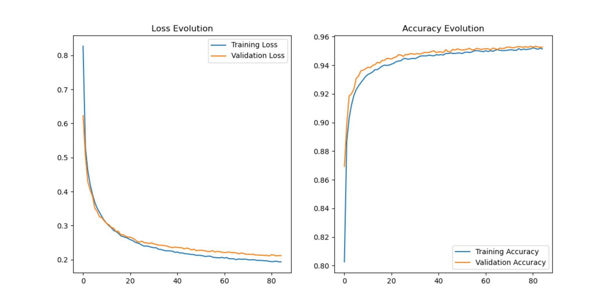
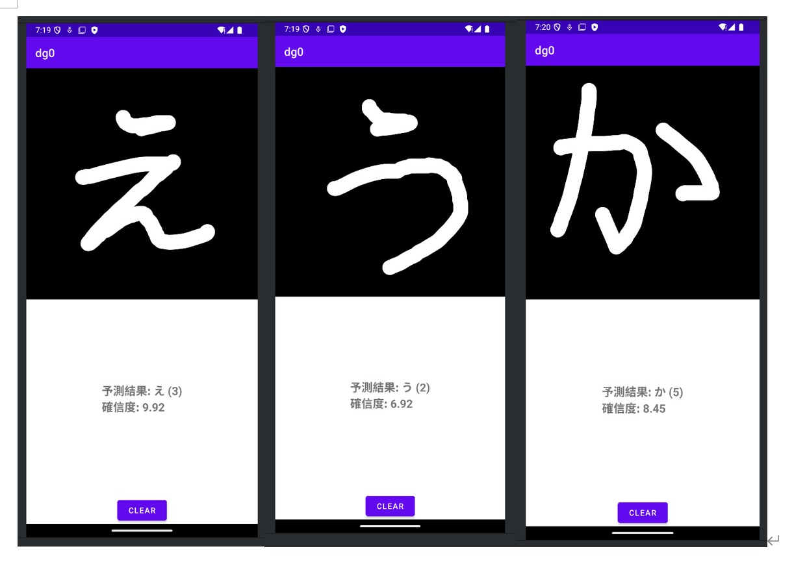

# Handwriting-Japanese-Character-Recognition-Mobile-Application

This project provides a mobile application for a early detection tool for diabetes, users to input Japanese characters on their cell phones by handwriting. Built with Python and Android Studio. TensorFlow were used to build models in the project for diabetes detection. In addition to this the project provides python files for visualization and model quantification and transformation.

## Table of Contents
- [Project Structure](#project-structure)
- [Dependencies](#dependencies)
- [Installation](#installation)
- [Usage](#usage)
- [Technical Details](#technical-details)
- [Commands](#commands)


## Project Structure
Main
```
.
├── App           # Mobile Application Design
└── handwrite      # Model Training
```
handwrite
```
.
├── train2.py      # Model Training and Evaluation
└── trans.py       # Model quantification and transformation
```

## Dependencies
- **Python 3.x**
- **TensorFlow**: 
- **Matplotlib**: Visualization.


Install dependencies using:
```bash
pip install TensorFlow Matplotlib
```

## Installation
1. Clone the repository:
   ```bash
   git clone https://github.com/KouHaoxuan/Handwriting-Japanese-Character-Recognition-Mobile-Application
   cd Handwriting-Japanese-Character-Recognition-Mobile-Application
   ```
2. Install the required packages (listed above).

## Usage
1. **Run the Application**: Open Android Studio and import the project file
2. **Connect the phone to the computer and install the phone program**: Install android phone app
3. **Handwriting in designated areas**: Recognition results and confidence levels are displayed below

## Technical Details
- **Step 1**: Data Loading and Preprocessing.
- **Step 2**: Model Training.
  ```python
  python train2.py
  ```
- **Step 3**: Model conversion (converting models to TensorFlow Lite format).
  ```python
  python trans.py
  ```
- **Step 4**: Importing tflite model files to an Android project.
 

## Results




### Reference:

```
@online{clanuwat2018deep,
  author       = {Tarin Clanuwat and Mikel Bober-Irizar and Asanobu Kitamoto and Alex Lamb and Kazuaki Yamamoto and David Ha},
  title        = {Deep Learning for Classical Japanese Literature},
  date         = {2018-12-03},
  year         = {2018},
  eprintclass  = {cs.CV},
  eprinttype   = {arXiv},
  eprint       = {cs.CV/1812.01718},
}
```
